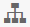
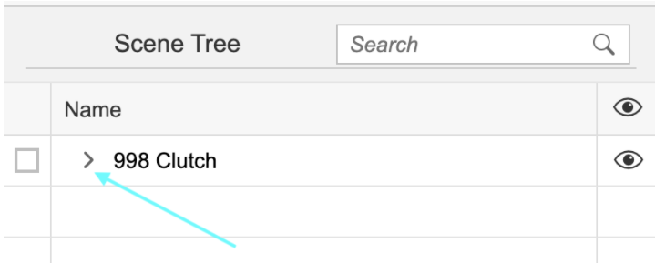
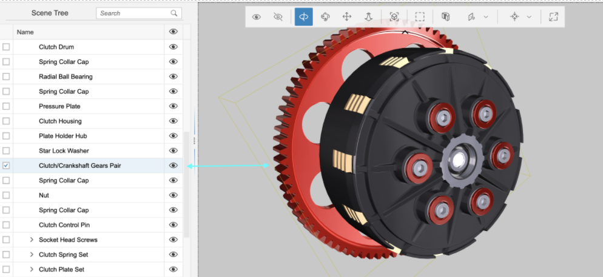
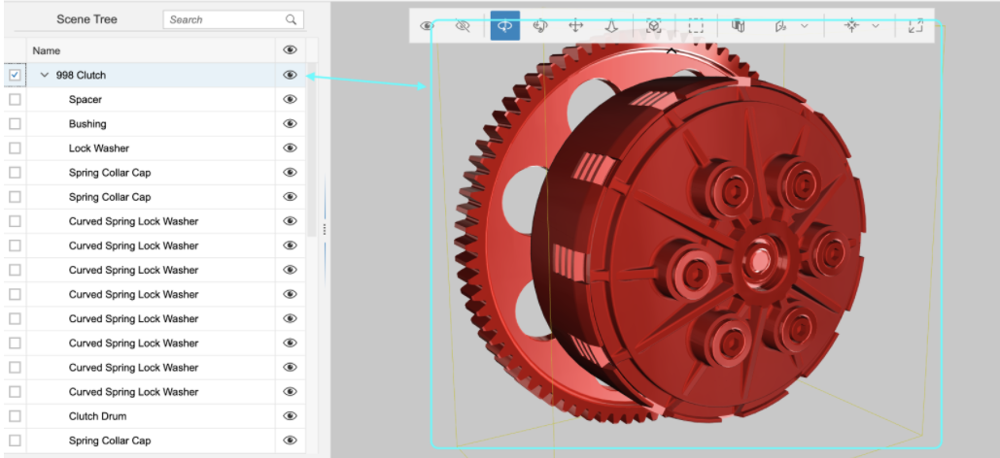
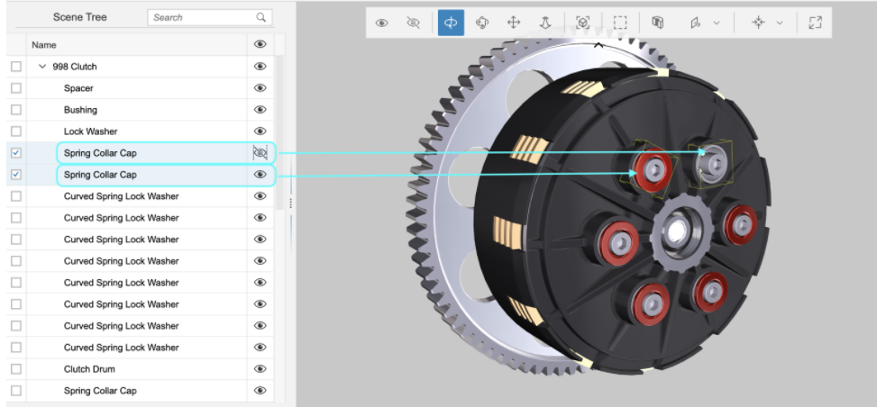
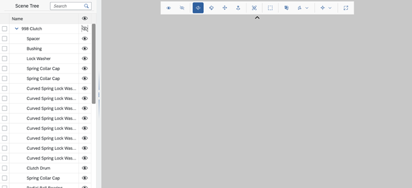

<!-- loioab7021546c72409d84eb97c6b1434e72 -->

# Scene Tree

The `sap.ui.vk.SceneTree` control presents a hierarchical view of the nodes in a given scene.

<a name="loioab7021546c72409d84eb97c6b1434e72__section_lws_tw1_qz"/>

## API Reference / Sample

-   [sap.ui.vk.SceneTree](https://ui5.sap.com/#/api/sap.ui.vk.SceneTree) in the *API Reference* in the Demo Kit
-   [3D Viewer - Step 4 - Add a Scene Tree](https://ui5.sap.com/#/entity/sap.ui.vk.tutorial.VIT/sample/sap.ui.vk.tutorial.VIT.04) in the Demo Kit

## Overview

The Scene Tree control \(`sap.ui.vk.SceneTree`\) presents a hierarchical view of all the nodes in a given scene.

## Prerequisites

Before a scene's nodes can appear in the Scene Tree, the Scene Tree control needs to be connected to:

-   a `ViewStateManager` object, which handles the visibility and selection states of a scene
-   a `Scene` object, so that the Scene Tree knows the nodes to display in the hierarchy

## Details

The Scene Tree displays the collection of nodes in a scene. You can add a Scene Tree to your application by using the `sap.ui.vk.SceneTree` control. The Scene Tree is also avaliable in the composite `sap.ui.vk.Viewer` control.

Before a scene's nodes can appear in the Scene Tree, you will need to set up two-way data binding between the Scene Tree and the Viewport in your application. Note that you can only bind to one Viewport instance at a time.

The following sections outline the Scene Tree's selection and visibility behavior in more detail.

### Hiding or Viewing the Scene Tree

When using the `sap.ui.vk.Viewer` control, the Scene Tree is enabled by default, which means that a `SceneTree` instance is created. You can toggle the visibility of the Scene Tree using the Scene Tree button in the Toolbar.

The following table outlines what the Scene Tree button looks like in these different states:

**Scene Tree button states**

<table>
<tr>
<th valign="top">

Scene Tree button state

</th>
<th valign="top">

Description

</th>
</tr>
<tr>
<td valign="top">

</td>
<td valign="top">

Scene Tree is shown \(this is the default state\).

</td>
</tr>
<tr>
<td valign="top">

</td>
<td valign="top">

Scene Tree is hidden.

</td>
</tr>
<tr>
<td valign="top">

</td>
<td valign="top">

Scene Tree is disabled, or, if a 2D file is loaded into the Viewer application.

</td>
</tr>
</table>

### Selecting Nodes in the Scene Tree

By default, the Scene Tree is collapsed so that only the top-level nodes in the Scene are displayed.

You can expand the Scene Tree by clicking on the *\>* icon next to a node to display that node's child nodes.

 

Selecting a node in the Scene Tree that has child nodes results in the node and its child nodes being selected in the Viewport. Selecting a node in the Scene Tree highlights that node in the Viewport, and vice versa. If you select a node in the Viewport that is currently hidden in the Scene Tree, the Scene Tree expands automatically to display the selected node in the Scene Tree's hierarchy. Any selected object is highlighted with a yellow bounding box around it.

### Toggling Node Visibility in the Scene Tree

Selecting a node in the Scene Tree highlights that node in the Viewport, and vice versa. You can toggle between displaying or hiding a node from view in the Viewport by clicking the 'eye' icon  next to a node in the Scene Tree. The following example shows a comparison of two similar nodes, but with one node hidden from view.

If you toggle the visibility for a node that has child nodes, the visibility change applies to the child nodes as well \(however, their visibility icon will not reflect this change\). This is intentional, to allow a visibility restore state. The child objects that were hidden when parent node visibility changed, remain hidden when the parent node is made visible again. The following example shows the root node being set to hidden, resulting in all of its child nodes being hidden as well.

> ### Tip:  
> Clicking the  icon in the table header has a different behavior. This usage is recursive; it reflects down the tree and changes the visibility state of all descendent nodes, overwriting their visibility state.
> 
> 

## Related Information

-   [Viewport](viewport-acd3467.md)

