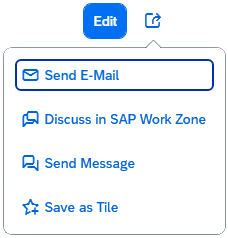

<!-- loio47dc86847f7a426a8e557167cf523bda -->

# Semantic Page \(sap.f\)

The `sap.f.semantic.SemanticPage` is an enhanced `sap.f.DynamicPage` that implements the SAP Fiori 2.0 design guidelines.

For more information about this control, see the [API Reference](https://ui5.sap.com/#/api/sap.f.semantic.SemanticPage) and the [Samples](https://ui5.sap.com/#/entity/sap.f.semantic.SemanticPage).


<a name="loio47dc86847f7a426a8e557167cf523bda__section_ddr_gnb_yz"/>

## Features

The `SemanticPage` exposes all the `DynamicPage`'s API, which means you can do everything that you are currently able to do with the `DynamicPage`.


### Title

The following aggregations are available to control the semantic in the title of the page:

-   Semantic text actions:

    -   `titleMainAction`

    -   `deleteAction`

    -   `copyAction`

    -   `addAction`


-   Semantic icon actions:

    -   `favoriteAction`

    -   `flagAction`


-   Semantic navigation actions:

    -   `fullScreenAction`

    -   `exitFullScreenAction`

    -   `closeAction`


-   Custom actions:

    -   `titleCustomTextActions`

    -   `titleCustomIconActions` 


The actions in the title are grouped to text actions or icon actions. When an aggregation is set, the action appears in the following predefined order \(from left to right\) as follows:

`titleMainAction`, `titleCustomTextActions`, semantic text actions \(`deleteAction`, `copyAction`, `addAction`\), `customIconActions`, semantic icon actions \(`favoriteAction`, `flagAction`\), share menu action, navigation actions \(`fullScreenAction`, `exitFullScreenAction`, `closeAction`\).

  


### Share Menu

The following aggregations are available to control the semantic in the share menu. They are positioned vertically in this order:

-   `sendEmailAction`

-   `discussInJamAction`

-   `shareInJamAction`

-   `sendMessageAction`

-   `printAction`

-   `customShareActions`


The actions in the share menu icon appear in the title when a related aggregation is used.

  


### Footer

The following aggregations are available to control the semantic in the page footer:

-   `footerMainAction`

-   `messagesIndicator`

-   `draftIndicator`

-   `positiveAction`

-   `negativeAction`

-   `footerCustomActions`


The actions in the footer are positioned either on its left or right area and have the following predefined order from left to right:

The left side contains the `messagesIndicator`, and the right side - `draftIndicator`, `footerMainAction`, `positiveAction`, `negativeAction` and `footerCustomActions`:

  


<a name="loio47dc86847f7a426a8e557167cf523bda__section_q4c_zld_zz"/>

## Examples


### Initialization

Definition in an XML view:

```xml
<mvc:View xmlns:mvc="sap.ui.core.mvc"
    xmlns:semantic="sap.f.semantic"
    controllerName="mycompany.myController"
    height="100%">
    <semantic:SemanticPage id="mySemanticPage">
        <!-- Semantic page content specified here -->
    </semantic:SemanticPage >
</mvc:View>
```

Definition in JavaScript:

```js
var oSemanticPage = new sap.f.semantic.SemanticPage("mySemanticPage");
oView.addContent(oSemanticPage);
```


### Adding content

Adding semantic content:

```xml
<mvc:View
   height="100%"
   xmlns:mvc="sap.ui.core.mvc"
   xmlns="sap.m"
   xmlns:semantic="sap.f.semantic">

   <semantic:SemanticPage>
      ...

      <!— will automatically create a button with “email” icon and style and position it in accord with the underlying semantics -->
      <semantic:sendEmailAction press=”onSendEmailPress >
         <semantic:SendEmailAction />
      </semantic:sendEmailAction>


     <!— will automatically create a button with icon, styling and positioning in accord with the underlying semantics -->
      <semantic:discussInJamAction press=”onDiscussInJamPress”>
         <semantic:DiscussInJamAction />
      </semantic:discussInJamAction>
 
     ...

   </semantic:SemanticPage>
</mvc:View>
```

Adding custom \(non-semantic\) content

```xml
<mvc:View
   height="100%"
   xmlns:mvc="sap.ui.core.mvc"
   xmlns="sap.m"
   xmlns:semantic="sap.f.semantic">

   <semantic:SemanticPage>

       ...
<!-- Title Heading-->
<semantic:titleHeading>
   <Title text="{/title}" />
</semantic:titleHeading>


<!-- Header Content -->
<semantic:headerContent>
      <!—custom header Content goes here -->
<FlexBox
      alignItems="Start"
      justifyContent="SpaceBetween">
   <items>
      <Panel backgroundDesign="Transparent">
         <content>
            <ObjectAttribute title="Functional Area" text="{/objectDescription/category}"/>
            <ObjectAttribute title="Cost Center" text="{/objectDescription/center}"/>
            <ObjectAttribute title="Email" text="{/objectDescription/email}"/>
         </content>
      </Panel>
      <ObjectStatus text="In Stock" state="{/objectDescription/status}" />
   </items>
</FlexBox>

</semantic:headerContent>


<!—Content -->
<semantic:content>
    <!—Custom page-body content gies here -->
   <Table
      id="idProductsTable"
      inset="false"
      items="{path:'/ProductCollection'}">
     ...
   </Table>
</semantic:content>


   </semantic:SemanticPage>
</mvc:View>
```

**Related Information**  


[API Reference: `sap.f.DynamicPage`](https://ui5.sap.com/#/api/sap.f.DynamicPage)

