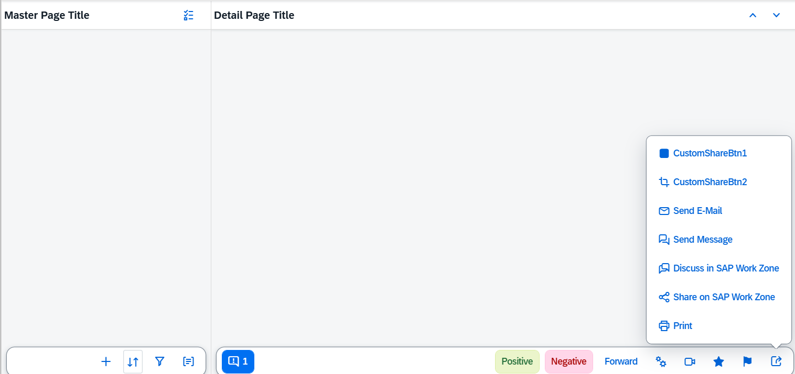
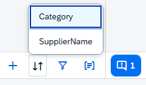
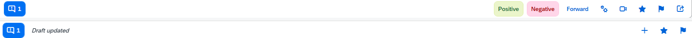

<!-- loio4a97a07ec8f5441d901994d82eaab1f5 -->

# Semantic Page \(sap.m\)

The `sap.m.semantic.SemanticPage` is an enhanced `sap.m.Page` that implements the SAP Fiori 1.0 design guidelines.

For more information about this control, see the [API Reference](https://ui5.sap.com/#/api/sap.m.semantic.SemanticPage) and the [samples](https://ui5.sap.com/#/entity/sap.m.semantic.SemanticPage).


<a name="loio4a97a07ec8f5441d901994d82eaab1f5__section_egg_t4d_zz"/>

## Features

The following categories give an overview of the internally defined semantic content that is supported:

-   Visual properties - content is styled in a certain way, for example an `AddAction` is displayed as an icon button.

-   Position in the page - some buttons are displayed in the page header only, while others are in the footer or in the share menu.

-   Sequence order - there is a specific sequence order of semantic controls with respect to each other.

-   Tooltip - there is a default localized tooltip for the icon-only buttons.

-   Overflow behavior - some of the buttons are allowed to go to the overflow area of the toolbar when the screen becomes narrower. For icon buttons, the text label of the button appears when the button is in the overflow area.

-   Screen reader support - there is invisible text for reading the semantic type.


The available semantic content is different buttons and selects. Each one can correspond to a common action, such as Add, Edit, Save, and Sort.

  
  
**Semantic content at its default positions on the page.**



Several different selects are supported for displaying a list of selectable items - `SortSelect`, `FilterSelect`, and `GroupSelect`.



The following aggregations are available and enable the apps to add their own custom content to the different areas of the page:

-   `customHeaderContent`
-   `customFooterContent`
-   `customShareMenuContent`
-   `content` - for content in the body of the page

The ordering logic of custom and semantic content is as follows from left to right:

-   Left area:

    -   `messagesIndicator`

    -   `draftIndicator`


-   Right area:

    -   `mainAction`

    -   Semantic text-only buttons, such as `deleteAction`, `positiveAction`, and `negativeAction`

    -   Custom content that the app fully controls with no automatic reordering

    -   Semantic icon-only buttons, such as `favoriteAction`, and `flagAction`





<a name="loio4a97a07ec8f5441d901994d82eaab1f5__section_gfg_hqd_zz"/>

## Examples


### Initialization

In the `sap.m` library, the semantic page controls are`sap.m.semantic.FullscreenPage`,`sap.m.semantic.MasterPage`, and `sap.m.semantic.DetailPage`. They have different purpose depending on the context:

For split-screen \(List-Detail\) scenarios, apps should use `sap.m.semantic.MasterPage` together with `sap.m.semantic.DetailPage`:

```xml
<mvc:View
height="100%"
xmlns:mvc="sap.ui.core.mvc"
xmlns="sap.m"
controllerName="mycompany.myController"
xmlns:semantic="sap.m.semantic"
displayBlock="true">

<SplitContainer>
   <masterPages>
      <semantic:MasterPage>
         <!-- master page content goes here -->
      </semantic:MasterPage>
   </masterPages>
   <detailPages>
      <semantic:DetailPage>
         <!-- detail page content goes here -->
      </semantic:DetailPage>
   </detailPages>
</SplitContainer>
</mvc:View>
```

For fullscreen scenarios \(where the page should always take the entire screen\), apps should use `sap.m.semantic.FullscreenPage`:

```xml
<mvc:View
height="100%"
xmlns:mvc="sap.ui.core.mvc"
xmlns="sap.m"
controllerName="mycompany.myController"
xmlns:semantic="sap.m.semantic"
displayBlock="true">

<App>
   <pages>
      <semantic:FullscreenPage>
         <!-- page content goes here -->
      </semantic: FullscreenPage >
   </pages>
</App>
</mvc:View>
```


### Adding semantic content:

The three semantic pages inherit from the abstract `sap.m.semantic.SemanticPage` control and each supports content that semantically belongs to its list/detail/fullscreen context.

For example, as the master part usually contains a list of items to be selected, so `sap.m.semantic.MasterPage` supports semantic controls for common operations on a list of items, such as sort, filter, group and multiselect:

```xml
...
<SplitContainer>
<masterPages>
   <semantic:MasterPage>

      <semantic:sort>
         <semantic:SortSelect change="onSortChange"
                         items="{
                     path: '/ProductCollectionStats/Filters',
                     sorter: { path: 'Name' }
                     }">
            <core:Item key="{type}" text="{type}" />
         </semantic:SortSelect>
      </semantic:sort>

      <semantic:filter>
         <semantic:FilterAction press="onFilterPress"/>
      </semantic:filter>

      <semantic:group>
         <semantic:GroupAction press="onGroupPress"/>
      </semantic:group>

   </semantic:MasterPage>
</masterPages>
<detailPages>
   ...
</detailPages>
</SplitContainer>
```

The `DetailPage` usually displays extended information for the item that was selected in the list part, therefore the `sap.m.semantic.DetailPage` also supports controls for operations like editing and sharing:

```xml
...
<SplitContainer>
       <masterPages>
              ...
        </masterPages>
        <detailPages>
              <semantic:DetailPage">

            <semantic:forwardAction>
                <semantic:ForwardAction press="onForwardPress"/>
            </semantic:forwardAction>

   <semantic:shareInJamAction>
      <semantic:ShareInJamAction press="onShareInJamPress"/>
   </semantic:shareInJamAction>

   <semantic:messagesIndicator>
      <semantic:MessagesIndicator press="onMessagesIndicatorPress"/>
   </semantic:messagesIndicator>

</semantic:DetailPage>

</detailPages>
</SplitContainer>
```


### Adding custom \(non-semantic\) content:

```xml
...
<semantic:FullscreenPage title="FullScreen Page Title"
                            showNavButton="true"
                            navButtonPress="onNavButtonPress">

                          <semantic:customHeaderContent>
                   <!-- custom header controls go here -->
                  <Button text="CustomHeaderBtn" press="onHeaderBtnPress"/>
               </semantic:customHeaderContent>


               <semantic:content>
                   <!-- custom page content goes here -->
                  <semantic:AddAction press="onSemanticButtonPress"/>
               </semantic:content>


                          <semantic:customFooterContent>
                   <!-- custom footer controls go here -->
                  <Button text="CustomFooterBtn" press="onFooterBtnPress"/>
                  <OverflowToolbarButton icon="sap-icon://settings" text="Settings" press="onSettingsPress"/>
               </semantic:customFooterContent>


                          <semantic:customShareMenuContent>
                   <!-- custom share-menu controls go here -->
                  <Button text="CustomShareMenuBtn" press="onShareMenuBtnPress"/>
               </semantic: customShareMenuContent >

</semantic:FullscreenPage>
```

**Related Information**  


[API Reference: `sap.m.Page`](https://ui5.sap.com/#/api/sap.m.Page)

