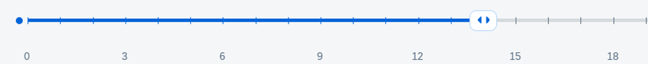
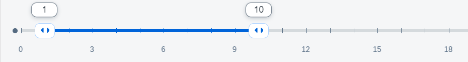

<!-- loio84ec82e7498345ccbfcd754d4578313b -->

# Sliders


<a name="loio84ec82e7498345ccbfcd754d4578313b__section_dnk_kqr_pdb"/>

## Control Overview

A slider is a control that enables you to adjust values on a specified range. SAPUI5 has two controls of this type - `sap.m.Slider` and `sap.m.RangeSlider`. The slider allows you to choose a single value, whereas with the RangeSlider you can choose an interval with start and end within a given interval.

   
  
<a name="loio84ec82e7498345ccbfcd754d4578313b__fig_z5n_rkx_pdb"/>Slider

  

   
  
<a name="loio84ec82e7498345ccbfcd754d4578313b__fig_tbk_skx_pdb"/>RangeSlider

  

Technically the RangeSlider extends `sap.m.Slider` and thus uses all its properties. It has two additional properties for the second slider value and the selected range.

Both versions of the control support features for tickmarks, labels and advanced tooltips. If you only need a simple native browser tooltip, you can enable `handleTooltip` and show it on mouse hover. For more advanced cases, you can customize the labels and the tooltips for the slider handles.


<a name="loio84ec82e7498345ccbfcd754d4578313b__section_ggb_lqr_pdb"/>

## Custom Scale

In the background, the sliders operate on floats, but some usecases may require that the range consists of other values, for example dates. In order to properly match your values to floats, you need to add custom scale and implement the `Iscale` interface.

```

// "Element" required from "sap/ui/core/Element"
var CustomScale = Element.extend("sap.xx.custom.CustomScale", {
				interfaces: [
					"sap.m.IScale"
				],
				library: "sap.xx.custom",
			});
```

You need to implement the following methods of the [IScale](https://ui5.sap.com/#/api/sap.m.IScale) interface.

-   `getTickmarksBetweenLabels` - Determine which tickmarks should have a label

-   `calcNumberOfTickmarks` - Determine the number of tickmarks on the scale

-   `handleResize` - Resize handler

-   `getLabel` - Getter for the label


This way you have full control over the labels, their placement, density, and text. As your custom labels may be longer , you will also need to show less tickmarks in order to prevent cluttering of the scale values.

This custom scale is then passed to the control.

```

// "Slider" required from "sap/m/Slider"
// "CustomScale" required from "sap/xx/custom/CustomScale"
// "CustomTooltip" required from "sap/xx/custom/CustomTooltip"
var oSlider = new Slider({
				min: 0,
				max: 30,
				value: 15,
				width: "80%",
				enableTickmarks: true,
				showAdvancedTooltip: true,
				scale: new CustomScale(),
				customTooltips: [new CustomTooltip()]
			})
```


<a name="loio84ec82e7498345ccbfcd754d4578313b__section_i4c_4qr_pdb"/>

## Custom Tooltips

In order to create a custom tooltip, you should extend the class `sap.m.SliderTooltipBase` and override some methods. If you want to define your own content for the tooltip, you should override just the `renderTooltipContent` method. If you want to be notified when the Slider's value has been changed, you need to implement the `sliderValueChanged` which takes as an argument the new value of the Slider, so you can adjust the value of the tooltip.

During rendering you can provide the content of the tooltips by writing directly to the DOM.

```
renderTooltipContent: function (oRm, oControl) {

							// you can write any DOM here - render controls or anything you want
							// (inline elements are not recommended as you need to style them on your own)
							oRm.openStart("div", oControl.getId() + "-inner");
							oRm.class("sapCustomSliderTooltip");
							oRm.openEnd();
							oRm.close("div")
```


<a name="loio84ec82e7498345ccbfcd754d4578313b__section_l3d_vkp_tdb"/>

## Accessibility for Sliders

Depending on the type of slider, you may need different values to be read out by the screen reader. In the case of a simple numeric slider, the screen reader will read the current float value. If you have a slider with a custom scale with tickmarks, the screen reader will read the value returned by `getLabel()` of the scale. If you have custom tooltips, then the return value from the tooltip formatter will be read. The priority for these id the following: Custom tooltips overrule custom scale and custom scale overrules the generic slider.

