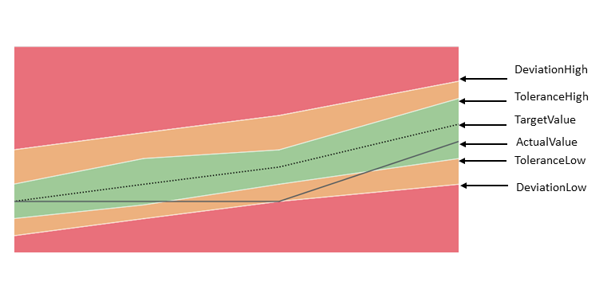
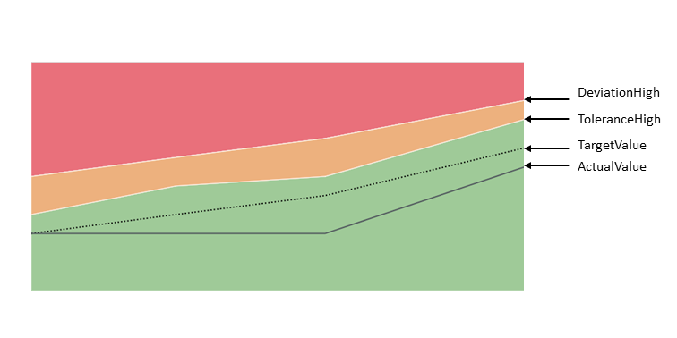
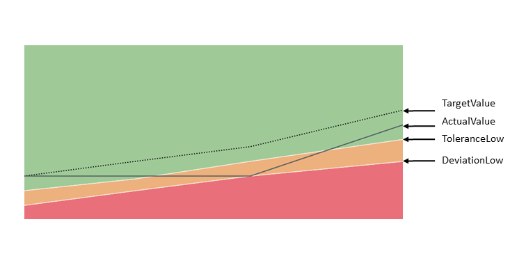

<!-- loio283cdca9709e4c4ebfa8f2324da371f9 -->

# Smart Area Micro Chart

The `sap.ui.comp.smartmicrochart.SmartAreaMicroChart` control creates an `sap.suite.ui.microchart.AreaMicroChart` control based on OData metadata.

For more information about this control, see the [API Reference](https://ui5.sap.com/#/api/sap.ui.comp.smartmicrochart.SmartAreaMicroChart) and the [Samples](https://ui5.sap.com/#/entity/sap.ui.comp.smartmicrochart.SmartAreaMicroChart) in the Demo Kit.

By using the `chartType` property *Area* of the *UI.Chart* annotation the corresponding `SmartAreaMicroChart` control is rendered. The `entitySet` attribute must be specified to use the control. This control property is used to fetch the corresponding annotations. Based on this, the `AreaMicroChart` will be rendered; it can also be used to fetch the actual chart data.

> ### Note:  
> The control can also be used directly \(without creating a `SmartMicroChart` control\).


## Details

**Binding**

The `SmartAreaMicroChart` control supports only `enableAutoBinding` = `true`. This means it should be bound to only **one** entitySet, and should get a navigation property as a chartBindingPath to an entitySet \(for the relative binding\) or else the `entitySet` property will be used for the absolute binding.

**Colors of the Chart \(Criticality\)**

The color of the chart is defined due to the thresholds by using the `CriticalityCalculation` property of the *UI.DataPoint* annotation and the `ImprovementDirection` property.

> ### Note:  
> Setting the color directly via the `Criticality` property of the *UI.DataPoint* annotation is not supported by SmartAreaMicroChart.

The following directions are supported:

**Target-oriented**:



**Minimize-oriented**:



**Maximize-oriented**:



For more information about the colors in the chart, see the [sample](https://ui5.sap.com/#/entity/sap.ui.comp.smartmicrochart.SmartAreaMicroChart/sample/sap.ui.comp.sample.smartmicrochart.SmartAreaMicroChart) in the Demo Kit.

**Labels, formatting and label colors of the chart**

The control provides labels that are displayed at the top and bottom of the chart. You can control the labels themselves, as well as the color of the labels, by using annotations:

-   [Labels of the Chart](labels-of-the-chart-8664d4b.md)
-   [Formatting](formatting-8cd1dc3.md)
-   [Label Colors of the Chart](label-colors-of-the-chart-aa4bf0f.md) \(criticality\)

**Title, Description and UnitOfMeasure**

The control provides the *Title*, *Description* or *UnitOfMeasure* values retrieved from the annotations. If needed, the application can create a corresponding `chartTitle`, `chartDescription` or `unitOfMeasure` \(of type `sap.m.Label`\) association. Then, the information will be read from the annotation document and it will be set as the `text` property of the `sap.m.Label`.

-   **Title and Description**

    For the *Title* and *Description* properties of the *Chart* annotation both `String` and `Path` are supported:

    -   `<PropertyValue Property="Title" Path="ChartTitle" />`
    -   `<PropertyValue Property="Title" String="ChartTitle" />` 

    > ### Note:  
    > Only the *Title* and *Description* properties of the *Chart* annotation are taken into account \(not these of the *DataPoint* annotation\).

    For the `SmartAreaMicroChart` control, the *Title*, *Description* and *UnitOfMeasure* have the same binding context as the chart itself \(either `chartBindingPath` or `entitySet`\).

-   **UnitOfMeasure**

    For more information about the supported annotation terms *ISOCurrency* and *Unit*, see [http://docs.oasis-open.org/odata/odata/v4.0/os/vocabularies/Org.OData.Measures.V1.xml](http://docs.oasis-open.org/odata/odata/v4.0/os/vocabularies/Org.OData.Measures.V1.xml).

    The control takes into account only the *measure* annotation for the `entityType` property that is addressed by the `Value` property of the *DataPoint* annotation. In the following example, the `Value` property of the *DataPoint* points to the `Price` property in the `EntityType` \(`Path`="`Price`"\). This means that the control \(`Path`="`Currency`"\) uses the *measure* annotation with `Target="AmcNamespace.StockPrice/Price"`:

    ```xml
    
    <EntityType Name="StockPrice">
    ....
    <Property Name="Currency" Type="Edm.String" />
    </EntityType>
    <Annotation Term="UI.DataPoint" Qualifier="AreaChartDataPoint">
    <PropertyValue Property="Value" Path="Price" />
    </Annotation>
    
    ```

    ```xml
    
    <Annotations xmlns="http://docs.oasis-open.org/odata/ns/edm" Target="AmcNamespace.StockPrice/Price" >
    	<Annotation Term="MEASURES.ISOCurrency" Path="Currency">
    	</Annotation>
    </Annotations>
    					 
    ```


