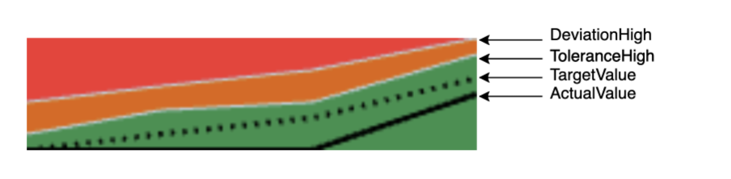

<!-- loio283cdca9709e4c4ebfa8f2324da371f9 -->

# Smart Area Micro Chart

The `sap.ui.comp.smartmicrochart.SmartAreaMicroChart` control creates a `sap.suite.ui.microchart.AreaMicroChart` control based on OData metadata.

The `SmartAreaMicroChart` control is rendered by using the `chartType` property *Area* of the *UI.Chart* annotation. The `entitySet` attribute must be specified to use the control. This control property is used to fetch the corresponding annotations. Based on this, the `AreaMicroChart` is rendered; it can also be used to fetch the actual chart data.

For more information, see the [API Reference](https://ui5.sap.com/#/api/sap.ui.comp.smartmicrochart.SmartAreaMicroChart) and the [Sample](https://ui5.sap.com/#/entity/sap.ui.comp.smartmicrochart.SmartAreaMicroChart).

> ### Note:  
> This control can also be used directly \(without creating a `SmartMicroChart` control\).


## Details

**Binding**

The `SmartAreaMicroChart` control only supports `enableAutoBinding` = `true`. This means it is bound to a single `entitySet`, and gets a navigation property as a `chartBindingPath` to an `entitySet` \(for the relative binding\). Otherwise, the `entitySet` property is used for absolute binding.

**Colors of the Chart \(Criticality\)**

The color of the chart is defined based on the thresholds by using the `CriticalityCalculation` and the `ImprovementDirection` property of the *UI.DataPoint* annotation.

> ### Note:  
> Setting the color directly using the `Criticality` property of the *UI.DataPoint* annotation is not supported by `SmartAreaMicroChart`.

The following directions are supported:

**Target-oriented**:


**Minimize-oriented**:



**Maximize-oriented**:


For more information, see the [Sample](https://ui5.sap.com/#/entity/sap.ui.comp.smartmicrochart.SmartAreaMicroChart/sample/sap.ui.comp.sample.smartmicrochart.SmartAreaMicroChart).

**Labels, Formatting and Label Colors of the Chart**

The control provides labels that are displayed at the top and bottom of the chart. You can control the labels themselves, as well as the color of the labels, by using annotations:

-   [Labels of the Chart](labels-of-the-chart-8664d4b.md)
-   [Formatting](formatting-8cd1dc3.md)
-   [Label Colors of the Chart](label-colors-of-the-chart-aa4bf0f.md) \(criticality\)

**Title, Description and UnitOfMeasure**

The control provides the *Title*, *Description* or *UnitOfMeasure* values retrieved from the annotations. If needed, the application can create a corresponding `chartTitle`, `chartDescription` or `unitOfMeasure` \(of type `sap.m.Label`\) association. The information is then read from the annotation document and it is set as the `text` property of the `sap.m.Label`.

-   **Title and Description**

    For the *Title* and *Description* properties of the *Chart* annotation both `String` and `Path` are supported:

    -   `<PropertyValue Property="Title" Path="ChartTitle" />`
    -   `<PropertyValue Property="Title" String="ChartTitle" />` 

    > ### Note:  
    > Only the *Title* and *Description* properties of the *Chart* annotation are taken into account \(not these of the *DataPoint* annotation\).

    For the `SmartAreaMicroChart` control, the *Title*, *Description* and *UnitOfMeasure* have the same binding context as the chart itself \(either `chartBindingPath` or `entitySet`\).

-   **UnitOfMeasure**

    For more information about the supported annotation terms *ISOCurrency* and *Unit*, see [http://docs.oasis-open.org/odata/odata/v4.0/os/vocabularies/Org.OData.Measures.V1.xml](http://docs.oasis-open.org/odata/odata/v4.0/os/vocabularies/Org.OData.Measures.V1.xml).

    The control takes into account only the *measure* annotation for the `entityType` property that is addressed by the `Value` property of the *DataPoint* annotation. In the following example, the `Value` property of the *DataPoint* points to the `Price` property in the `EntityType` \(`Path`="`Price`"\). This means that the control \(`Path`="`Currency`"\) uses the *measure* annotation with `Target="AmcNamespace.StockPrice/Price"`:

    ```xml
    
    <EntityType Name="StockPrice">
    ....
    <Property Name="Currency" Type="Edm.String" />
    </EntityType>
    <Annotation Term="UI.DataPoint" Qualifier="AreaChartDataPoint">
    <PropertyValue Property="Value" Path="Price" />
    </Annotation>
    
    ```

    ```xml
    
    <Annotations xmlns="http://docs.oasis-open.org/odata/ns/edm" Target="AmcNamespace.StockPrice/Price" >
    	<Annotation Term="MEASURES.ISOCurrency" Path="Currency">
    	</Annotation>
    </Annotations>
    					 
    ```


