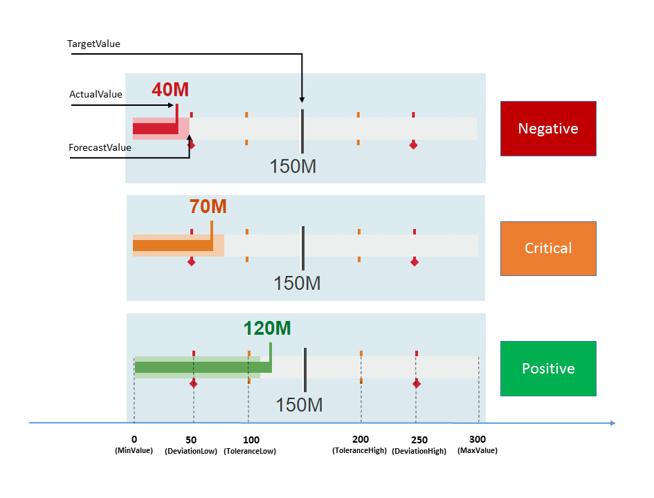
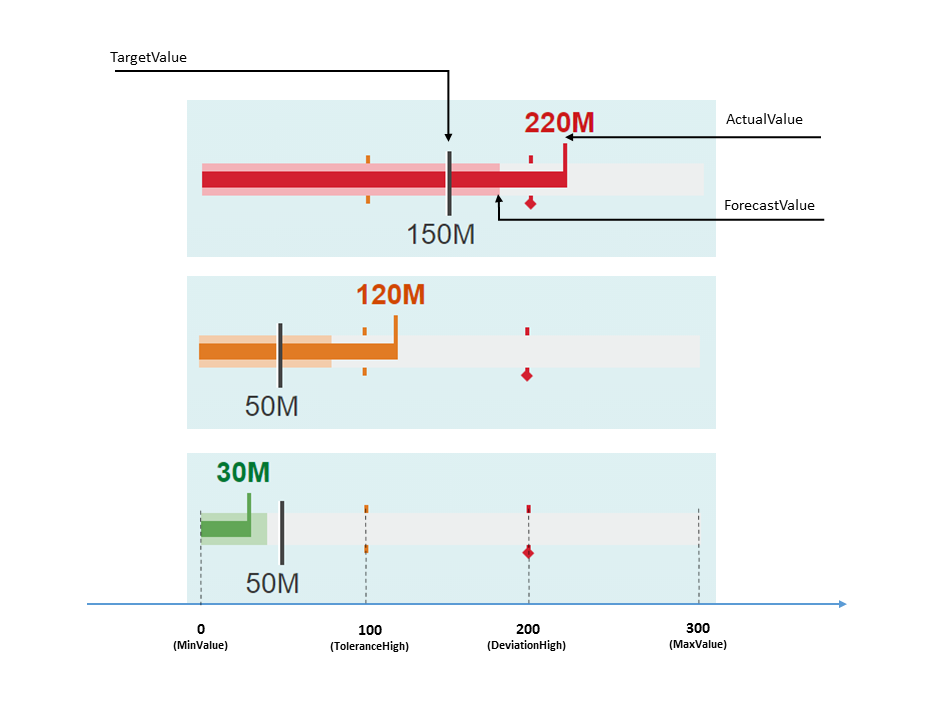
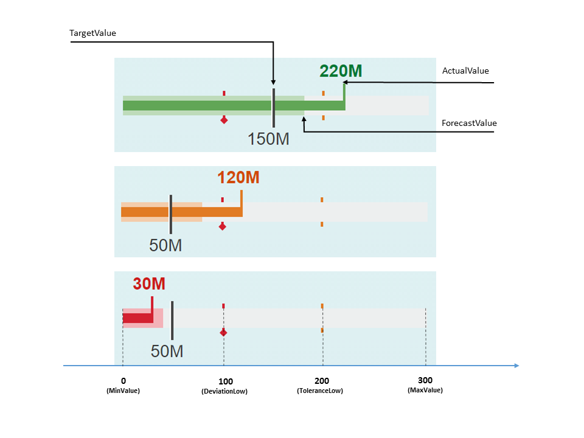

<!-- loiob28959d6cbf6429980da065e990edb06 -->

# Smart Bullet Micro Chart

The `sap.ui.comp.smartmicrochart.SmartBulletMicroChart` control creates an `sap.suite.ui.microchart.BulletMicroChart` control based on OData metadata.

For more information about this control, see the [API Reference](https://ui5.sap.com/#/api/sap.ui.comp.smartmicrochart.SmartBulletMicroChart) and the [Samples](https://ui5.sap.com/#/entity/sap.ui.comp.smartmicrochart.SmartBulletMicroChart) in the Demo Kit.

By using the `chartType` property *Bullet* of the *UI.Chart* annotation the corresponding `SmartBulletMicroChart` control is rendered. The `entitySet` property of the control must be specified. This attribute is used to fetch metadata and annotation information from the given default OData model. Based on this, the Bullet Micro Chart is created.

> ### Note:  
> The control can also be used directly \(without creating a SmartMicroChart\).


## Binding

The `SmartBulletMicroChart` control should be bound to **one** entity, and not a collection of entities \(entitySet\). It supports both `enableAutoBinding` = `false` \(no binding is done inside the control\) and `enableAutoBinding` = `true` :

-   If the `chartBindingPath` is provided, the control will be bound relatively to it. For example, the `chartBindingPath` can be a navigation property.

-   If `chartBindingPath` is not provided, the control will be bound absolutely to the entitySet.


For information on how the control provides *Title*, *Description* and *UnitOfMeasure* values retrieved from the annotations, please see the *Title, Description and UnitOfMeasures* section in the [Smart Area Micro Chart](smart-area-micro-chart-283cdca.md) documentation.

> ### Note:  
> If `enableAutoBinding` = `true` and `chartBindingPath` is set then the `bindingContext` for the *Title*, *Description* and *UnitOfMeasure* is set to the value as well.


## Color of the Chart bar \(Criticality\)

The color of the chart bars can be controlled by the *Criticality* property either directly or by calculation.

-   Criticality can be set directly:

    ```xml
    
    <EntityType Name="ProductType" >
    …
    <Property Name="Criticality" Type="Edm.String" />
    </EntityType>
    <Annotation Term="UI.DataPoint" Qualifier="BulletChartDataPoint">
    <PropertyValue Path="Criticality" Property="Criticality" />
    …
    </Annotation>
    ```

-   Criticality can be calculated by the `SmartBulletMicroChart` control based on the provided thresholds and the `ImprovementDirection` property of the *DataPoint* annotation.

    > ### Note:  
    > The target and forecast values are not taken into account for the color calculation.

    **ImprovementDirection Property**

    The following values for the `ImprovementDirection` property are supported:

    -   **Target**

        

        Code Example

        ```xml
        
        <EntityType Name="ProductType"  >
                 <Key>
                         <PropertyRef Name="Product" />
                 </Key>
                         <Property Name="Product" Type="Edm.String" Nullable="false"/>
                         <Property Name="Revenue" Type="Edm.Decimal"/>
                         <Property Name="TargetRevenue" Type="Edm.Decimal"/>
                                <Property Name="ForecastRevenue" Type="Edm.Decimal"/>
                                <Property Name="ToleranceRangeLow" Type="Edm.Decimal"/>
                                <Property Name="ToleranceRangeHigh" Type="Edm.Decimal"/>
                                <Property Name="DeviationRangeLow" Type="Edm.Decimal"/>
                                <Property Name="DeviationRangeHigh" Type="Edm.Decimal"/>
        </EntityType>
        .....
         <Annotations Target="BmcNamespace.ProductType" xmlns="http://docs.oasis-open.org/odata/ns/edm">
                         <Annotation Term="UI.Chart">
                            <Record>
                               <PropertyValue EnumMember="UI.ChartType/Bullet" Property="ChartType" />
                               <PropertyValue Property="Measures">
                                       <Collection>
                                        <PropertyPath>Revenue</PropertyPath>
                                       </Collection>
                               </PropertyValue>
                               <PropertyValue Property="MeasureAttributes">
                                       <Collection>
                            	<Record Type="UI.ChartMeasureAttributeType">
                              	  <PropertyValue Property="Measure" PropertyPath="Revenue" />
                               	  <PropertyValue Property="Role" EnumMember="UI.ChartMeasureRoleType/Axis1" />
                                  <PropertyValue Property="DataPoint" AnnotationPath="@UI.DataPoint#BulletChartDataPoint" />
                            	</Record>
                                       </Collection>
                               </PropertyValue>
                           </Record>
                         </Annotation>
                         <Annotation Term="UI.DataPoint" Qualifier="BulletChartDataPoint">
                           <Record>
                             <PropertyValue String="Product" Property="Title" />
                             <PropertyValue Path="Revenue" Property="Value" />
                             <PropertyValue Path="TargetRevenue" Property="TargetValue" />
                             <PropertyValue Path="ForecastRevenue" Property="ForecastValue" />
                             <PropertyValue Decimal="100" Property="MinimumValue" />
                             <PropertyValue Decimal="300" Property="MaximumValue" />
                             <PropertyValue Property="CriticalityCalculation">
        	                  <Record>
        	                     <PropertyValue Property="ImprovementDirection" EnumMember="UI.ImprovementDirectionType/Target"/>
        	                     <PropertyValue Path="ToleranceRangeLow" Property="ToleranceRangeLowValue" />
        	                     <PropertyValue Path="ToleranceRangeHigh" Property="ToleranceRangeHighValue" />
        	                     <PropertyValue Path="DeviationRangeLow" Property="DeviationRangeLowValue" />
        	                     <PropertyValue Path="DeviationRangeHigh" Property="DeviationRangeHighValue" />
        	                   </Record>
                            </PropertyValue>
                           </Record>
                      </Annotation>
         </Annotations>
        			
        ```

    -   **Minimize**

        

        Related to the code example for *target*, the code line for the `ImprovementDirection` *minimize* would be as follows:

        ```xml
        Property="ImprovementDirection" EnumMember="UI.ImprovementDirectionType/Minimize"
        ```

    -   **Maximize**

        

        Related to the code example for *target*, the code line for the `ImprovementDirection` *maximize* would be as follows:

        ```xml
        Property="ImprovementDirection" EnumMember="UI.ImprovementDirectionType/Maximize"
        ```


