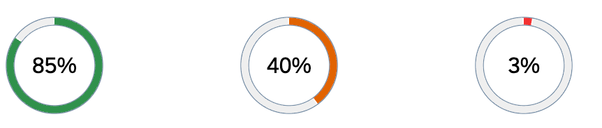
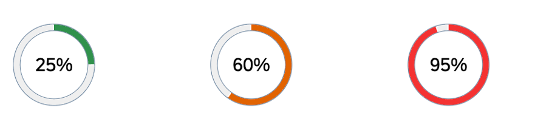

<!-- loiof8b31037ea284ef6a5a85c55762461b2 -->

# Smart Radial Micro Chart

The `sap.ui.comp.smartmicrochart.SmartRadialMicroChart` control creates an `sap.suite.ui.microchart.RadialMicroChart` control based on OData metadata.

By using the `chartType` property *Donut* of the *UI.Chart* annotation, the corresponding `SmartRadialMicroChart` control is rendered. The `entitySet` attribute must be specified to use the control. The attribute is used to fetch metadata and annotation information from the given default OData model. Based on this, the *RadialMicroChart* UI is created. As the other `SmartMicroCharts`, the `sap.ui.comp.smartmicrochart.SmartRadialMicroChart` control also uses the OData metadata annotations to determine the binding paths and values inside the chart.

> ### Note:  
> The control can also be used directly \(without creating a SmartMicroChart\).

For more information, see the [API Reference](https://ui5.sap.com/#/api/sap.ui.comp.smartmicrochart.SmartRadialMicroChart) and the [Sample](https://ui5.sap.com/#/entity/sap.ui.comp.smartmicrochart.SmartRadialMicroChart) in the Demo Kit.


<a name="loiof8b31037ea284ef6a5a85c55762461b2__section_j1r_hp1_mz"/>

## Associated Labels


For information on how the control provides a *Title*, *Description* and *UnitOfMeasure* values retrieved from the annotations, see the *Title*, *Description* and *UnitOfMeasure* values in [Smart Area Micro Chart](smart-area-micro-chart-283cdca.md).

In addition, the Smart Radial Micro Chart supports a *FreeText* value. This can be annotated by the term [Label](https://wiki.scn.sap.com/wiki/display/EmTech/OData+4.0+Vocabularies+-+SAP+Common). For more information, see the [API Reference](https://ui5.sap.com/#/api/sap.ui.comp.smartmicrochart.SmartRadialMicroChart).


## Binding

The `SmartRadialMicroChart` control binds to **one** entity and not to a collection of entities \(`entitySet`\). It supports both `enableAutoBinding` = `false` \(no binding is done inside the control\) and `enableAutoBinding` = `true` :

-   If the `chartBindingPath` is provided, the control binds relatively to it. For example, the `chartBindingPath` can be a navigation property.

-   If `chartBindingPath` is not provided, the control binds absolutely to the `entitySet`.


> ### Note:  
> If `enableAutoBinding` = `true` and `chartBindingPath` is set then the `bindingContext` for the *Title*, *Description*, *UnitOfMeasure* and *FreeText* is set to the value as well.


## Criticality

The color of the chart can be controlled by the `Criticality` property either directly or by criticality calculation. For the `sap.ui.comp.smartmicrochart.SmartRadialMicroChart` control, there are two options for setting the color of the `RadialMicroChart` by using its `valueColor` property:

-   by setting it directly using the `Criticality` property of the `UI.DataPoint` annotation
-   with the criticality calculation using the `CriticalityCalculation` property of the `UI.DataPoint` annotation

Using the first option, the user can bind the property to a path in the application's model. The criticality is then mapped to a `valueColor`:

```xml
<PropertyValue Property="Criticality" Path="Criticality"/>
```

The mapping is done as follows:

**Criticality Mapped to ValueColor**


<table>
<tr>
<th valign="top">

Criticality

</th>
<th valign="top">

ValueColor

</th>
</tr>
<tr>
<td valign="top">

Neutral

</td>
<td valign="top">

Neutral

</td>
</tr>
<tr>
<td valign="top">

Positive

</td>
<td valign="top">

Good

</td>
</tr>
<tr>
<td valign="top">

Critical

</td>
<td valign="top">

Critical

</td>
</tr>
<tr>
<td valign="top">

Negative

</td>
<td valign="top">

Error

</td>
</tr>
</table>

In the second option, the criticality can be calculated using customer-defined thresholds.


> ### Note:  
> The thresholds are not renderd in `SmartRadialMicroChart`.

**Thresholds**


<table>
<tr>
<th valign="top">

Property

</th>
<th valign="top">

Type

</th>
<th valign="top">

Sample Values

</th>
</tr>
<tr>
<td valign="top">

DeviationLowValue

</td>
<td valign="top">

Negative

</td>
<td valign="top">

10

</td>
</tr>
<tr>
<td valign="top">

ToleranceLowValue

</td>
<td valign="top">

Critical

</td>
<td valign="top">

45

</td>
</tr>
<tr>
<td valign="top">

ToleranceHighValue

</td>
<td valign="top">

Critical

</td>
<td valign="top">

55

</td>
</tr>
<tr>
<td valign="top">

DeviationHighValue

</td>
<td valign="top">

Negative

</td>
<td valign="top">

80

</td>
</tr>
</table>

With the `ImprovementDirection` property the thresholds can determine the `valueColor`. For `sap.ui.comp.smartmicrochart.SmartRadialMicroChart` the *Maximize* and *Minimize* directions are supported:

-   **`ImprovementDirection`: Maximize**

    The **Maximize** direction is calculated as the higher the value, the more the color trends towards green and the status is more positive. Depending on the relevant thresholds \(`DeviationLowValue` and `ToleranceLowValue`\), there are appropriate points where the color changes. Reflecting the provided sample data, values lower than 10 are in red color, values lower than 45 but higher than 10 are displayed in orange color and all values higher than 45 are in green color.

    

-   **ImprovementDirection: Minimize**

    With theMinimize direction, it is calculated the lower the value the more the circle color trends to green or the higher the value the more negative is its status. This direction uses the `ToleranceHighValue` and `DeviationHighValue` thresholds. Reflecting the sample data above, values higher than 80 will be shown in red color, values lower than 80 but higher than 55 are displayed in orange color and all values lower than 55 are shown in green color.

    


