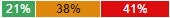
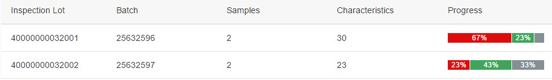
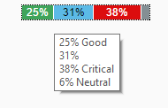

<!-- loiod4c48c84e413424ca2833e7e57fce56f -->

# Stacked Bar Micro Chart

The control shows a progress chart that displays the overall progress and a summary of the items.

Various bars can have different value colors, for example for different statuses such as accepted, rejected, and open items. There is no limit to the number of bars that the `StackedBarMicroChart` control can contain.

The `sap.suite.ui.microchart.StackedBarMicroChart` control is designed to display key figures or numbers inside a set of bars defined by different lengths and colors. It can be displayed standalone or in a table.

  

  

## Details

**Bar values**

The progress status of each item can be defined as an absolute value or as a percentage \(`value` property\). Each stacked bar is part of the chart that is defined as 100% \(if you are working with percentages\) or as an absolute value \(if you are working with a maximum value\). If you do not set a maximum value \(`maxValue` property\), the sum of all bar values is considered as the maximum value and the displayed value is set as a percentage for each item.

The number of decimal places for percentage values is, by default, 1. This can be changed by the application using the `precision` property. If the percentage values are used as labels, the `precision` property affects the length of the labels. Take this into account when the length of the bar is limited or there is not enough space to display the whole label.

**Bar colors**

By default, the given value is displayed as a label inside the bar, but you can overwrite it in your application using the `displayValue` property. You can also overwrite the default color of the bar \(`valueColor` property\) using predefined `less` parameters for colors, predefined semantic parameters \(for example, `Error`, `Critical`, `Good`, `Neutral`\) or even hex values, such as `#fafafa`. If there is no color, the micro chart automatically chooses one of the chart colors \(`sapUiChart1-11`\).

**Text and background colors**

The text color adapts automatically depending on the corresponding bar background color. If there is a dark background, a light text color is used and if there is a light background, a dark text color is used.

**Chart size**

You can define the chart with the `size` property. If you use a fixed size, you can select predefined sizes \(XS, S, M, L\). If you use a responsive design, you can use the `responsive` property value. The chart size is then adjusted based on the surrounding container size, for example in a `sap.m.FlexBox` control. The maximum height of the chart is 1 rem. If there is not enough space to show the labels, they are not displayed. If there is not enough space to show the micro chart, it is not displayed either.

**Integration and use**

The `sap.suite.ui.microchart.StackedBarMicroChart` control is a chart control and aggregates the bars of type `sap.suite.ui.microchart.StackedBarMicroChartBar`. One chart can contain one or more bars. You can call it up by clicking the mouse button or by using the [Space\] or [Enter\] key.

**Tooltip support**

The chart can have a tooltip with predefined `displayValue` property values or calculated percent values and it can be set on bar level and on chart level. Each value of the chart is displayed in the tooltip in a separate line. When the bar has a semantic color, the text \(for example Good, Critical\) will be added behind the displayed value. In some cases the text in the tooltip has another name than the semantic color. The tooltip can be suppressed by setting its value to an empty string.

## API Reference/Sample

For more information about the `StackedBarMicroChart` control, see the [API Reference](https://ui5.sap.com/#/api/sap.suite.ui.microchart.StackedBarMicroChart) and the samples in the Demo Kit.

