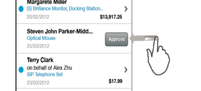

<!-- loioa01822c503014bc0bc6e31dfe7906817 -->

# Swipe for Action

If a user swipes left on a list item within a list or table, you can bring in a control, for example a button, to initiate an action for this item. The button is displayed on the right-hand side of the list item. An example is shown in the following graphic:

  

-   **[Aggregation](aggregation-d4e69ad.md "")**  

-   **[Events](events-e498329.md "")**  

-   **[Methods](methods-b72874d.md "")**  

-   **[Properties](properties-37c52c9.md "")**  

