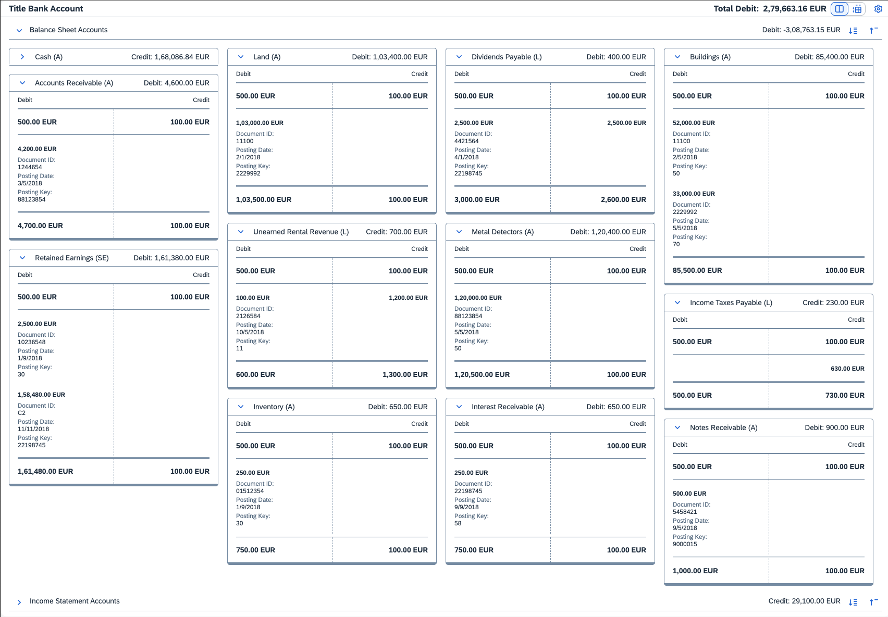

<!-- loiofe6792fa673c4b0fba91d35fd6493c86 -->

# T Account

The T account control displays debit and credit entries on a general ledger account.

The `TAccount` control can be used to display debit and credit entries on a general ledger account, visualizing the flow of transactions through the accounts where they are stored.

You can group T accounts by type, such as balance sheet T accounts and income statement T accounts, displaying multiple T accounts together. The T account group provides total balances for all T accounts included in this group. It also highlights matching debit and credit entries within the same group when an entry is clicked or tapped. In addition, you can display all T accounts and T account groups on a T account panel that provides a toolbar with total balances for all T account and T account groups included in the panel.

<a name="loiofe6792fa673c4b0fba91d35fd6493c86__section_ok4_lwb_mfb"/>

## Overview

In double-entry bookkeeping, journal entries are transferred to the general ledger by posting their debit and credit amounts on specific ledger accounts, which are often referred to as T accounts. A ledger account \(or T account\) is usually displayed in a format that resembles the letter T: with the account name above the T, debit entries to the left of the T, and credit entries to the right of the T.

T accounts are usually clustered together, so that accountants can analyze how individual line items from different journal entries affect the ledger balances.

For more information, see the [API Reference](https://ui5.sap.com/#/api/sap.suite.ui.commons.taccount.TAccount) and the [Sample](https://ui5.sap.com/#/entity/sap.suite.ui.commons.taccount.TAccount).

<a name="loiofe6792fa673c4b0fba91d35fd6493c86__section_zdq_fcc_mfb"/>

## Details

**Layout and Grouping**

The T account control provides three subcontrols that can be used to create different layout combinations:

-   [`TAccount`](https://ui5.sap.com/#/api/sap.suite.ui.commons.taccount.TAccount) – A basic T account control with debit and credit entries arranged on either side of the T shape.

-   [`TAccountGroup`](https://ui5.sap.com/#/api/sap.suite.ui.commons.taccount.TAccountGroup) – A group that includes multiple `TAccount` controls and displays them side by side. A T account group can be expanded or collapsed. It also provides total balance for the accounts included in the group.

-   [`TAccountPanel`](https://ui5.sap.com/#/api/sap.suite.ui.commons.taccount.TAccountPanel) – A panel that combines multiple `TAccountGroup` and `TAccount` controls, providing total balance for all accounts and groups included in this panel. It also enables you to switch between T account view and table view and adjust display options.

**Customizing**

You can add color indicators for debit and credit entries using the `color` property of the `TAccountItem` control. This can be an arbitrary color, but for consistency with other SAP Fiori apps, it is recommended that you use semantic colors defined by the [sap.m.ColorPalette](https://ui5.sap.com/#/api/sap.m.ColorPalette) or [sap.ui.unified.ColorPicker](https://ui5.sap.com/#/api/sap.ui.unified.ColorPicker) on the app level.

You can define additional properties for debit and credit entries using `TAccountItemProperty` elements that can be added to the `properties` aggregation of the `TAccountItem` control. For details, see the [API Reference](https://ui5.sap.com/#/api/sap.suite.ui.commons.taccount.TAccountItemProperty).

**Restrictions**

It is recommended that all entries displayed in a single T account use the same currency.

If debit and credit entries are in different currencies, the `TAccount` control does not convert the values to the currency specified in its `measureOfUnit` property. In such cases, the overall account balance is not displayed.

> ### Note:  
> Entries greater than 9007199254740992 should be passed as a string to prevent truncation or loss of precision.

Similarly, if T accounts in a T account group are in different currencies, the overall balance of the group cannot be calculated and is not displayed.

