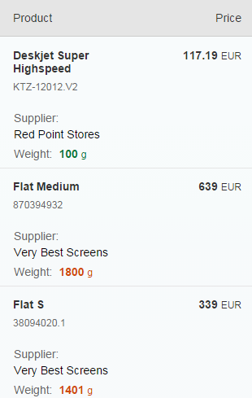
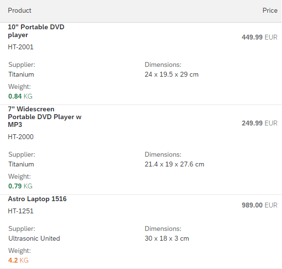
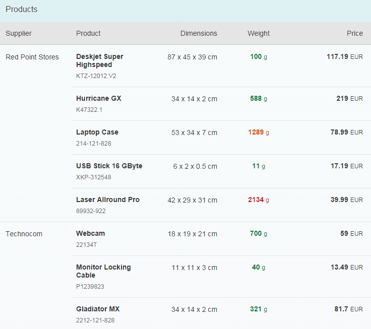
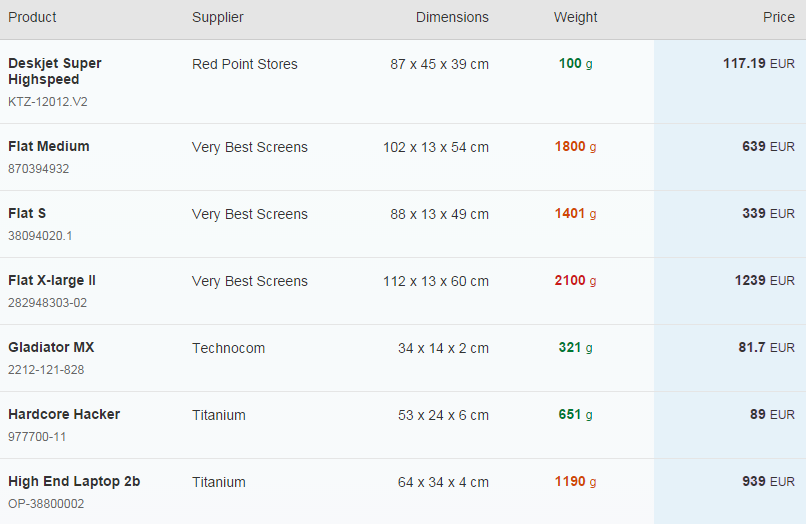

<!-- loiod3234bc1b7b64af99a3d6990039f7eed -->

# Table Design

The table design in SAPUI5 can be changed by using various table and column features, such as the pop-in design.


## Pop-in Design

When displaying information in a pop-in, the information, typically a column header and the column \(cell\) content, can be displayed in an `Inline` or in a `Block` display style. The difference between these two can be seen in the following example.

```js

   <columns>
      <Column
        width="12em">
        <Text text="Product" />
      </Column>
      <Column
        popinDisplay: "Block"
        minScreenWidth="Tablet"
        demandPopin="true">
        <Text text="Supplier" />
      </Column>
      <Column
        popinDisplay: "Inline"
        minScreenWidth="Tablet"
        hAlign="End">
        <Text text="Dimensions" />
      </Column>
      <Column
        popinDisplay: "Inline"
        minScreenWidth="Tablet"
        demandPopin="true"
        hAlign="Center">
        <Text text="Weight" />
      </Column>
      <Column
        hAlign="End">
        <Text text="Price" />
      </Column>
    </columns>

```

The *Dimension* column is hidden, the *Weight* column is displayed in a pop-in when the screen size is smaller than a desktop. The *Supplier* is to be displayed in `Block` mode, with the header and content arranged vertically, whereas the two prices are to be displayed in `Inline` mode, with the header and content arranged next to each other.




### Pop-in Design Layout

The described pop-in design is provided by a table by default. However, you can change the pop-in layout in the table by defining the relevant property like this: `popinLayout="GridSmall"` or `popinLayout="GridLarge"`. By default, `popinLayout="Block"` is set for a table. The pop-in columns are rendered as shown in the image above. With the `GridSmall` and `GridLarge` layouts, the pop-in columns are rendered next to each other if there is enough space available.

  

For more information, see the [Sample](https://ui5.sap.com/#/entity/sap.m.Table/sample/sap.m.sample.Table). Use the `ComboBox` control provided in the table toolbar to switch between the different pop-in layouts and see the visual differences.


## Merging Duplicate Values

When you have repeated values in your table, you can use the `mergeDuplicate` feature of the `sap.m.Column` control. There are two properties that are related to merging duplicate values:

-   `mergeDuplicates`: Set this to true if you want duplicate values for the given column to be merged

-   `mergeFunctionName`: Use this to specify the name of the getter function of the control in the column


Duplicate values will only be merged if they are adjacent. This means that you should sort your data first before binding it.

> ### Note:  
> When using `sap.m.Column` in a table, the column merging feature is not supported when used in combination with two-way binding.

Here's an example of how to use the `mergeDuplicates` feature. We'll set up a table of sales data and display the data in a table, merging any duplicate regions. When the *Mix Up* button is pressed to lightly shuffle the `salesFigures` array of objects, you will see that only adjacent duplicates are merged. Press the *Sort* button again to see the ideal merging.

```js

<Table
    headerText="Products"
    items="{
      path:'/ProductCollection',
      sorter: {
        path: 'SupplierName',
        descending: false
      }
    }" >
    <columns>
      <Column mergeDuplicates="true">
        <header>
          <Text text="Supplier" />
        </header>
      </Column>
      <Column mergeDuplicates="true">
        <header>
          <Text text="Product" />
        </header>
      </Column>
      <Column
        minScreenWidth="Tablet"
        demandPopin="true"
        hAlign="End" >
        <header>
          <Text text="Dimensions" />
        </header>
      </Column>
      <Column
        minScreenWidth="Tablet"
        demandPopin="true"
        hAlign="Center" >
        <header>
          <Text text="Weight" />
        </header>
      </Column>
      <Column hAlign="End" >
        <header>
          <Text text="Price" />
        </header>
      </Column>
    </columns>
    <ColumnListItem>
      <Text text="{SupplierName}" />
      <ObjectIdentifier title="{Name}" text="{ProductId}" class="sapUiTinyMarginTopBottom" />
      <Text text="{Width} x {Depth} x {Height} {DimUnit}" />
      <ObjectNumber
        number="{WeightMeasure}" unit="{WeightUnit}"
        state="{
          path: 'WeightMeasure',
          formatter: 'sap.m.sample.TableMergeCells.Formatter.weightState'
        }" />
      <ObjectNumber
        number="{Price}"
        unit="{CurrencyCode}" />
    </ColumnListItem>
  </Table>

```




## Highlighting Rows and Columns

You can use CSS to achieve striping for table rows, as you might do in other web-based applications, for example to highlight alternate rows in the table above so that it looks like this:


You just need to note the ID of the `sap.m.List` or `sap.m.Table` control \(in this case it is `"salesdata"`\) and then apply some appropriate CSS such as:

```
#ProductsView-ProductsTable tbody tr:nth-child(even) {
	background: rgb(245, 245, 245);
}

```

> ### Note:  
> Use *<even\>*, rather than *<odd\>* for the sibling specification. This way, the pop-in highlighting will be correct.

It's also possible to highlight table columns by using the `styleClass` property of the `sap.m.Column` control. The value of this property is applied as a class to the whole column \(header, cells and footer\) and can be used in the following way: specify a class name for the `styleClass` property of your column, and set the style as you wish:

```js

<style>
#products .MyPrice {
  background: @sapUiNeutralBG;
}
</style>

...

<Column
   hAlign="End"
   class="myPrice">
   <Text text="Price" />
</Column>

```

This highlights the *Price* column in our example table, as shown below:



