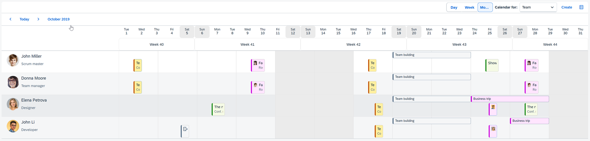
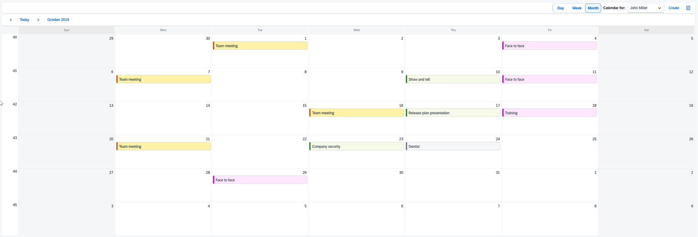
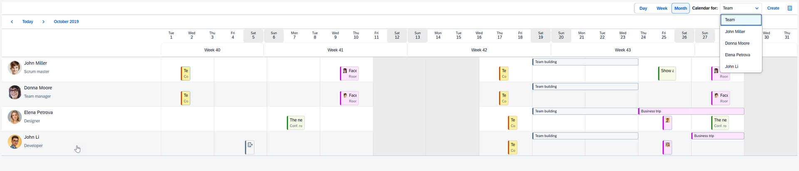
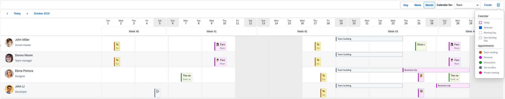

<!-- loioacae0f2794234730b74ed219d2532b77 -->

# Team Calendar

The **Team Calendar** application demonstrates the integration between `sap.m.PlanningCalendar` and `sap.m.SinglePlanningCalendar` controls, sharing the same data source. It can be used as a starting point for building a complex application with the full functionality that these controls offer \(adding, editing, deleting and moving of appointments, etc.\).

The demo application provides the following features and elements:

-   **Team Calendar** page, where all the members of the team are displayed with their appointments - represented by `sap.m.PlanningCalendar`.

-   **Team Member Calendar**, where appointments of a single selected member are displayed - represented by `sap.m.SinglePlanningCalendar`.

There are some additional buttons \(`sap.m.Button`\), that activate features like Calendar Legend and Create Appointment. Integration \(OPA\) tests are also included in the functionality demonstrated by the application. The data in this model include also settings used for application setup like start date and initially selected view for both calendars, supported appointment types, etc. The application is built with Dynamic Page control \(`sap.f.DynamicPage`\) and the switch between the two calendars happens without loading of the pages. Calendars are loaded as fragments in a container within the Dynamic Page content aggregation. For more information about the features and options for extending the app, see the Demo Kit Sample pages for [sap.m.PlanningCalendar](https://ui5.sap.com/#/entity/sap.m.PlanningCalendar) and [sap.m.SinglePlanningCalendar](https://ui5.sap.com/#/entity/sap.m.SinglePlanningCalendar).

<a name="loioacae0f2794234730b74ed219d2532b77__section_k2c_k5x_vkb"/>

## Team Calendar

The Team Calendar is implemented using `sap.m.PlanningCalendar` control.

  

All members of the team are displayed with their appointments. There are also:

-   Calendar views: Days, Week, and Month.

-   Team Member Selector \(`sap.m.Select`\) is located in the header and navigates to a selected personal Team Member Calendar.

-   *Create* new appointment button \(`sap.m.Button`\).

-   Calendar Legend button, displaying different calendar day and appointment types.

<a name="loioacae0f2794234730b74ed219d2532b77__section_eky_wt2_wkb"/>

## Team Member Calendar

  

Team Member Calendar \(`sap.m.SinglePlanningCalendar`\) displays appointments of a single selected team member. It also includes:

-   Calendar views: Day, Week, and Month.

-   Team Member Selector \(`sap.m.Select`\) is located in the header and navigates to a selected personal Team Member Calendar.

-   *Create* new appointment button \(`sap.m.Button`\).

-   Calendar Legend button \(`sap.m.Button`\).

<a name="loioacae0f2794234730b74ed219d2532b77__section_vnc_n52_wkb"/>

## Navigation

The navigation between Team Calendar and Team Member Calendar is available using the Team Member Selector.

  

The *Create* button adds new appointments and the Calendar Legend button displays the legend.

  

Find the Team Calendar under [Demo Apps](https://ui5.sap.com/#/demoapps).

