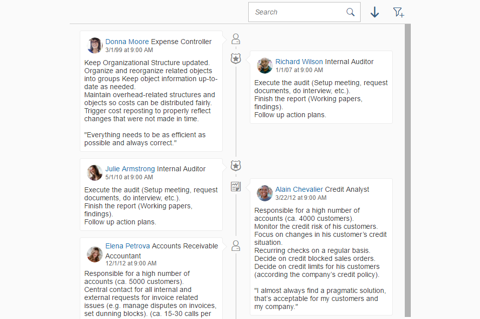

<!-- loiob8993f310d3e451c8c81ce63f835b737 -->

# Timeline

The `Timeline` control displays a list of events, changes, or posts in chronological order.

For more information about this control, see the [API Reference](https://ui5.sap.com/#/api/sap.suite.ui.commons.Timeline) and the [samples](https://ui5.sap.com/#/entity/sap.suite.ui.commons.Timeline) in the Demo Kit.


<a name="loiob8993f310d3e451c8c81ce63f835b737__section_zy4_vjh_mz"/>

## Overview

The `Timeline` control shows information related to an object in chronological or reverse chronological order. This information may include entries, changes, or events related to an object. Every change, event, or entry is represented by a post on the timeline axis. The posts can be either generated by the system or added manually.

  
  
**Timeline Example**



Even though manual data entry is supported, it is recommended that you use data binding to pull data into the timeline.

The timeline does not have a fixed location on the UI. Where you place it depends on your use case. For example:

-   If the timeline is closely related to the content and needs to be seen in parallel, you can use the dynamic side content floorplan. For more information, see the [API Reference: `sap.ui.layout.DynamicSideContent`](https://ui5.sap.com/#/api/sap.ui.layout.DynamicSideContent). 

-   If the timeline contains only secondary information, or needs to be accessed occasionally, you can embed it in a tab. For more information, see the [API Reference: `sap.m.IconTabBar`](https://ui5.sap.com/#/api/sap.m.IconTabBar). 

-   If you are using the object page floorplan, you can use the horizontal layout to integrate the timeline. For more information, see the [API Reference: `sap.uxap.ObjectPageLayout`](https://ui5.sap.com/#/api/sap.uxap.ObjectPageLayout). See also *Details* \> *Layout and Appearance* below.


These are only some of the ways you can position the timeline on a page.


<a name="loiob8993f310d3e451c8c81ce63f835b737__section_ups_vph_mz"/>

## Details

**Data Binding**

-   There are two types of data binding that you can use to pull data into timeline posts:

    -   JSON binding

    -   OData binding


-   If JSON data binding is used, it is recommended that you add a function that converts all date strings into dates. For example:

    ```js
    function convertData(oEvent) {
        var oModel = oEvent.getSource();
    
    	if (!oEvent.getParameters().success) {
    		return;
    	}
    
    	oModel.getData().Employees.forEach(function (oEmployee) {
    		oEmployee.HireDate = sap.suite.ui.commons.utilDateUtils.parseDate(oEmployee.HireDate);
    	});
    	oModel.updateBindings(true);
    }
    
    ```

    If strings are not converted into dates, sorting of the timeline posts may fail.

-   If your timeline provides filtering, it is important that you enable filtering directly on the binding level by setting the `enableModelFilter` property to `true`. This allows the filtering to be performed before any data is pulled into the timeline. If the `enableModelFilter` property is set to `false`, the timeline loads all data before performing the filtering, which may lead to performance issues.

    If you use filtering over a large amount of data \(more than 100 timeline posts\), you may need to increase the data model's size limit. The default limit is 100, which means that filtering is performed over the first 100 items in the data set. To increase the data model's size limit, set the model’s `sizeLimit` property to a higher number. For details, see [`sap.ui.model.Model.html#setSizeLimit`](https://ui5.sap.com/#/api/sap.ui.model.Model/methods/setSizeLimit). 


**Initialization**

The way you initialize a timeline depends on whether you want to use JSON model binding, OData model binding, or no binding at all.

-   JSON Data Binding

    ```json
    // File data.json
    {
    	"Employees": [
    		{
    			"Name": "Laurent Dubois",
    			"JobTitle": "Accounts Payable Manager",
    			"JobResponsibilities": "Plans, organizes and manages the operations and activities of an accounts payables.\nSupervises employees and monitors activities.\nFinal check of accounts payable payments and sign off.\nReporting to the head of finance.\n\n\"I am a diligent person. I put great attention to detail.\"",
    			"HireDate": "Date(1371020400000)"
    		}
    	]
    }
    
    ```

    ```js
    // controller.js
    
    // a function that converts date strings into dates
    function convertData(oEvent) {
    	var oModel = oEvent.getSource();
    
    	if (!oEvent.getParameters().success) {
    		return;
    	}
    
    	oModel.getData().Employees.forEach(function (oEmployee) {
    		oEmployee.HireDate = sap.suite.ui.commons.utilDateUtils.parseDate(oEmployee.HireDate);
    	});
    	oModel.updateBindings(true);
    }
    
    // in onInit function
    var oModel = new JSONModel("data.json");
    oModel.attachRequestCompleted(convertData);
    var oItem = new TimelineItem({
    	dateTime: "{HireDate}",
    	title: "{JobTitle}",
    	text: "{JobResponsibilities}",
    	userName: "{Name}"
    });
    var oTimeline = new Timeline({
    	enableDoubleSided: true
    });
    oTimeline.bindAggregation("content", {
    	path: "/Employees",
    	template: oItem
    });
    oTimeline.setModel(oModel);
    ```

-   OData Model Binding

    ```js
    var oModel = new ODataModel("http://services.odata.org/V3/Northwind/Northwind.svc/", true);
    var oItem = new TimelineItem({
    	dateTime: "{HireDate}",
    	title: "{Title}",
        text: "{Notes}",
        userName: "{FirstName} {LastName}"
    });
    var oTimeline = new Timeline({
        enableDoubleSided: true
    });
    oTimeline.bindAggregation("content", {
        path: "/Employees",
        template: oItem
    });
    oTimeline.setModel(oModel);
    ```

-   No Data Binding

    ```js
    var oTimeline = new Timeline("myNiceTimeline", {
    	content: [
    		new TimelineItem({
    			dateTime: new Date(2016, 1, 1),
    			icon: "sap-icon://accept",
    			title: "Title 1",
    			text: "Some comment"
    		}),
    		new TimelineItem({
    			dateTime: new Date(2015, 2, 2),
    			icon: "sap-icon://decline",
    			title: "Title 2",
    			text: "Some comment"
    		})
    	]
    });
    ```


**Layout and Appearance**

-   **Basic layout** – A timeline consists of a chronological axis, timeline posts, and an optional [header](https://ui5.sap.com/#/api/sap.suite.ui.commons.Timeline/methods/setShowHeaderBar). The header may include a [search field](https://ui5.sap.com/#/api/sap.suite.ui.commons.Timeline/methods/setShowSearch), as well as [sorting](https://ui5.sap.com/#/api/sap.suite.ui.commons.Timeline/methods/setSort), [filtering](https://ui5.sap.com/#/api/sap.suite.ui.commons.Timeline/methods/setShowItemFilter), and [grouping](https://ui5.sap.com/#/api/sap.suite.ui.commons.Timeline/methods/setGroupByType) options.

    You can set the timeline axis to be displayed [vertically or horizontally](https://ui5.sap.com/#/api/sap.suite.ui.commons.Timeline/methods/setAxisOrientation), with the posts arranged on one or [both](https://ui5.sap.com/#/api/sap.suite.ui.commons.Timeline/methods/setEnableDoubleSided) sides of the axis. The posts can be displayed in chronological or reverse chronological [order](https://ui5.sap.com/#/api/sap.suite.ui.commons.Timeline/methods/setSortOldestFirst).

-   **Scroll bar** – It is not recommended that you use the timeline control inside a [scroll container](https://ui5.sap.com/#/api/sap.m.ScrollContainer). Please use the timeline’s `enableScroll` property instead. When the timeline’s `enableScroll` property is set to `true`, the timeline has its own scroll bar.

    If you still want to use your timeline inside a [scroll container](https://ui5.sap.com/#/api/sap.m.ScrollContainer), make sure that your timeline meets the following requirements:

    -   The timeline’s `growingThreshold` property is set to `0`.

    -   The `lazyLoading` property is set to `false`.

    -   The `forceGrowing` property is set to `false`.


-   **Node icons** – Timeline posts can have optional node icons displayed on the timeline axis itself. To define the icons used for posts, use the `icon` property of the `TimelineItem` object. If you want the icons to use semantic colors that indicate the status conveyed by the post, use the `status` property of the `TimelineItem` object.

    If you don’t want to display any icons on the timeline axis itself, set the timeline’s `showIcons` property to `false`.


**Responsiveness**

-   The timeline control works with multiple screen sizes. If your timeline uses double-sided layout \(the `enabledDoubleSided` property is set to `true`\), the posts are displayed on one side of the timeline axis on smaller screens. The side depends on the `alignment` property settings.


**Integration with Other Controls**

-   You can embed other SAPUI5 controls into timeline posts. However, please note that not all properties that work for ordinary posts can be applied to posts with embedded controls. For example, the `textHeight` property cannot be applied correctly to posts with embedded controls.


**Related Information**  


[Data Binding](../04_Essentials/data-binding-68b9644.md "You use data binding to bind UI elements to data sources to keep the data in sync and allow data editing on the UI.")

[API Reference: `sap.m.ScrollContainer`](https://ui5.sap.com/#/api/sap.m.ScrollContainer)

