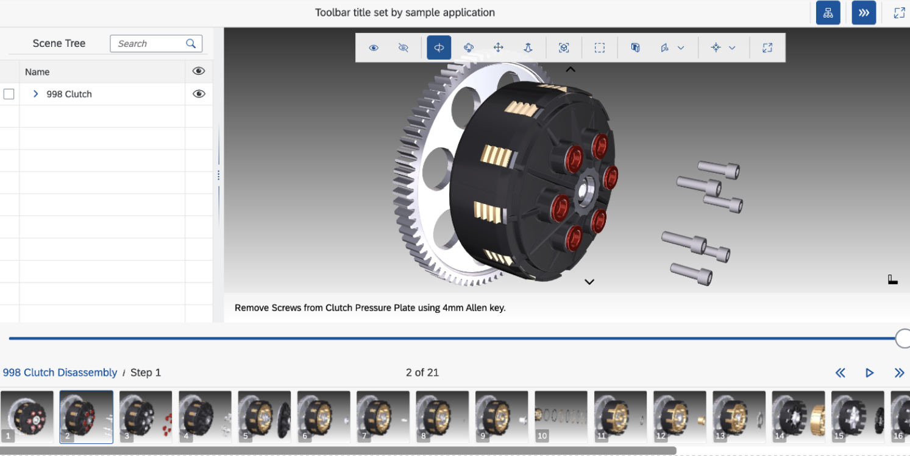
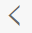
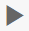
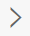

<!-- loio4717af4919e34245ba91905be4b57836 -->

# View Gallery

The `sap.ui.vk.ViewGallery` control replaces the `sap.ui.vk.StepNavigation` control which enables navigation and activation of procedures and steps contained in a single 3D scene. The `sap.ui.vk.StepNavigation` control is deprecated as it is used with DVL rendering engine only.

## Overview

The VDS file format supports pre-authored animations, also known as steps. Steps are grouped into procedures.

The View Gallery \(`sap.ui.vk.ViewGallery`\) control allows you to see which animations are available in a 3D scene. You can play an animation for an individual step, or play all the steps for a single procedure from start to finish

## Details

### View Gallery User Interface

The View Gallery control can be divided into two parts; the top part of the control contains animation control buttons and current procedure/step name which also allows you to choose a procedure, play, pause, or skip a step. Below these buttons, thumbnails of each step are displayed. You can hover over a thumbnail to show the name of the step, and click on a thumbnail to play the step.

The following table describes the functionality of each of the buttons or dropdown menus in the Step Navigation control:

**Step Navigation buttons and dropdown menus**

<table>
<tr>
<th valign="top">

Button / Menu name

</th>
<th valign="top">

Icon

</th>
<th valign="top">

Description

</th>
</tr>
<tr>
<td valign="top">

*Previous*

</td>
<td valign="top">

</td>
<td valign="top">

Plays the previous step in the procedure.

</td>
</tr>
<tr>
<td valign="top">

*Play/ Pause*

</td>
<td valign="top">

</td>
<td valign="top">

Plays entire procedure from the currently selected step. During play, this button changes to a pause button which can then be used to the pause currently playing animation.

</td>
</tr>
<tr>
<td valign="top">

*Next*

</td>
<td valign="top">

</td>
<td valign="top">

Plays the next step in the procedure.

</td>
</tr>
<tr>
<td valign="top">

*Procedure names*

</td>
<td valign="top">

\(the dropdown menu located to the right of the *Play* button\)

</td>
<td valign="top">

Select which procedure in the scene to play. Depending on the loaded model, you may have one or more procedures to select from.

</td>
</tr>
</table>

> ### Note:  
> Individual buttons and menus cannot be disabled.

In addition to using these buttons and the procedure selection control to select which procedure to load, you can also click on the thumbnail for a step to play the animation associated with that individual step \(other steps are not played\).

While a step is playing, you can still rotate, pan, or zoom in the scene.

### Hiding or Displaying the View Gallery Control

You can hide or view the View Gallery control using the *Step Navigation* \(\) button in the toolbar \(if `sap.ui.vk.Toolbar` is used in the application\).

By default, View Gallery is hidden from view. You can change this so that when a scene with animation is loaded into your application, then the View Gallery control is displayed.

